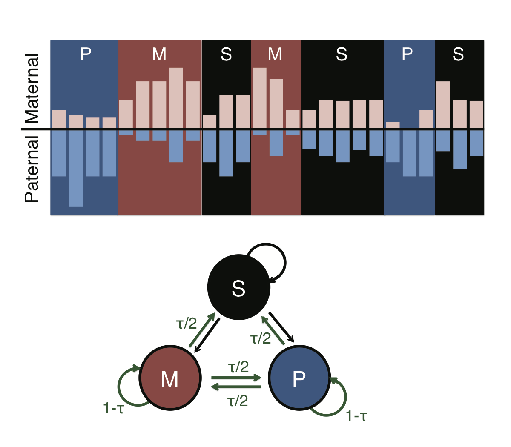

# AlleleHMM
The key goal of AlleleHMM is to identify allele-specific blocks of signal in distributed functional genomic data assuming that contiguous genomic regions share correlated allele-specific events. We developed a HMM that represents allelic bias in a distributed genomic mark using three hidden states: symmetric (S) distribution of the mark from both parental alleles (which shows no allelic bias), and maternally- (M) or paternally-biased (P) regions. AlleleHMM takes read counts corresponding to each allele as input. AlleleHMM uses these allele-specific read counts to set the parameters of the HMM using Baum Welch expectation maximization. The Viterbi algorithm is then used to identify the most likely hidden states through the data, resulting in a series of candidate blocks of signal with allelic bias.

+ AlleleHMM.py - identifies candidate allele-specific blocks
+ BinomialTest.bsh - performs Binomial tests on those candidate allele-specific blocks, and output AlleleHMM blocks with significantly allele-biased (FDR<= 10%).



## AlleleHMM.py 
### Usage
```````
python AlleleHMM.py [options]

options:

To get help:
-h,                    Show this brief help menu.

Required options:
For non-strand-specific data such as ChIP-seq:
-i, --input_hmm=PATH   Path to the non-strnad-specific, allele-specific read counts file (AlleleHMM_input.txt)

For strand-specific data such as PRO-seq:
-p, --input_plus_hmm=PATH    Path to the plus-strand allele-specific read counts file (AlleleHMM_input_plus.txt)
-m, --input_minus_hmm=PATH   Path to the minus-strand allele-specific read counts file (AlleleHMM_input_minus.txt)

Optional operations:
-o, --output_prefix=STR      prefix for the output file. default=AlleleHMM_output
-t, --tao=FLOAT   AlleleHMM identify allele-specific blocks using 9 values of t (1E-01, 1E-02, ...,1E-09) by default.
                  User can assign a specific tao for the calculation.
```````

+ For strand-specific data such as PRO-seq, please prepare two files.
  * AlleleHMM_input_plus.txt: allele-specific read counts file generated from plus strand
  * AlleleHMM_input_minus.txt: allele-specific read counts file generated from minus strand
```````
python AlleleHMM.py -p AlleleHMM_input_plus.txt -m AlleleHMM_input_minus.txt
```````
+ For non-strand-specific data such as ChIP-seq, please prepare one file AlleleHMM_input.txt.
```````
python AlleleHMM.py -i AlleleHMM_input.txt
```````

### Input files

AlleleHMM takes the allele-specific read counts file in the following formats, please note that:
+ Please use tab delimited text file
+ Must have header at the first line and only the first line.
+ SNP position (snppos) must be sorted according to genomic location. 
+ Please see examples in the input_file_examples folder.

    ```````
    chrm    snppos  mat_allele_count        pat_allele_count        total_reads_count       state
    chr1    565006  0       17      17      P
    chr1    565286  46      0       46      M
    chr1    565406  37      0       37      M
    chr1    565419  31      0       31      M
    chr1    565591  27      0       27      M
    chr1    566573  0       2       2       S
    chr1    568214  0       6       6       P
    chr1    569094  93      0       93      M
    chr1    569933  0       2       2       S
    ```````


### Output files
+ Please see examples in the output_file_exmaples folder.
+ AlleleHMM_output_[STRAND]_regions_t[TAO].bed: candidate blocks of signal with allelic bias in bed file format.
    * Col1: Chromosome name, sorted by dictionary-order
    * Col4: hidden states
    * Col6: + for plus strand, - for minus strand, space for non-strand-specific
    ```````
    chr1    565005  565006  P       111     +
    chr1    565285  565591  M       111     +
    chr1    566572  568214  P       111     +
    chr1    569093  569094  M       111     +
    chr1    569932  16971948        S       111     +
    ```````
+ AlleleHMM_output_t=[TAO]_parameters.txt: Optimized transition probability and expected materal reads fraction of three states (M,P,S) using AlleleHMM. 
    * t_ij: transition probability from state i to state j
    * p_i: expected materal reads fraction of state i.v
    ```````
    T=[[t_mm t_ms t_mp]
      [t_sm t_ss t_sp]
      [t_pm t_ps t_pp]]
    P= [p_m, p_s, p_p]
    ```````
## BinomialTest.bsh

